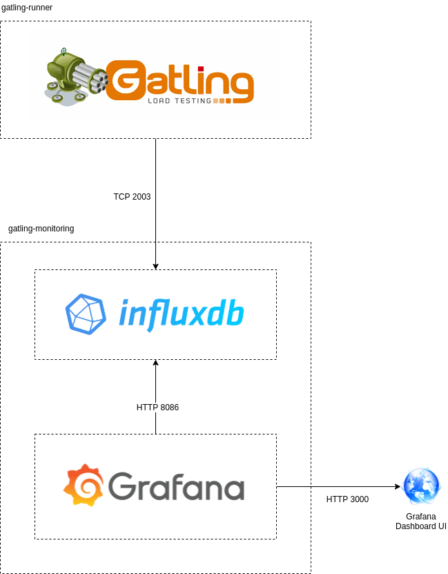

# Gatling Realtime Monitoring in AWS ECS
This repository contains the AWS infrastructure as code and Docker images for a Gatling setup with support for realtime monitoring (as 
described [here](https://gatling.io/docs/current/realtime_monitoring/)).

## Architecture
The architecture for this solution is as follows:

## Infrastructure as code
The infrastructure for this Gatling setup is written in code by leveraging the AWS CDK (Cloud Development Kit). 
This Gatling solution consists of three applications that will each run inside a Docker container. These Docker containers 
will be managed by [AWS ECS](https://aws.amazon.com/ecs/) and run by ECS Fargate.
The AWS CDK cloud components can be found in [aws-cdk](aws-cdk). See the [README](aws-cdk/README.md) for more information.

## Docker images
The custom docker images for Grafana, InfluxDB and Gatling can be found in [gatling-monitoring](gatling-monitoring).
See the [README](gatling-monitoring/README.md) for more information.

