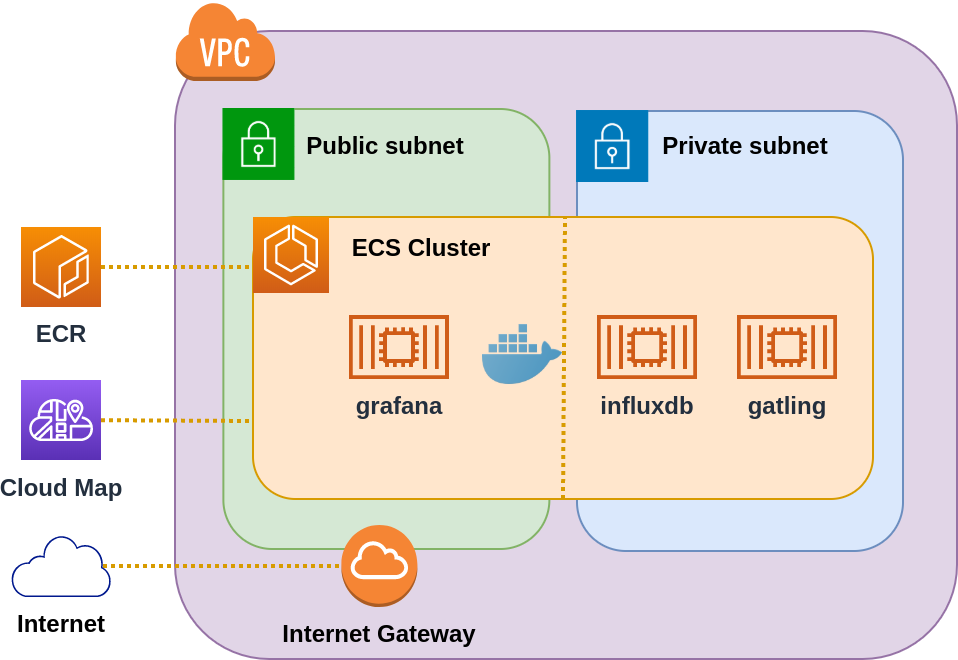

# AWS infrastructure for Gatling realtime monitoring
The required AWS infrastructure for the Gatling realtime monitoring project is depicted in the following image:
 

For demonstration purposes there are AWS CDK application implementations for this infrastructure in Java and TypeScript.
The Java project can be found in [aws-cdk-java](aws-cdk-java) and the TypeScript project is located in [aws-cdk-typescript](aws-cdk-typescript).
